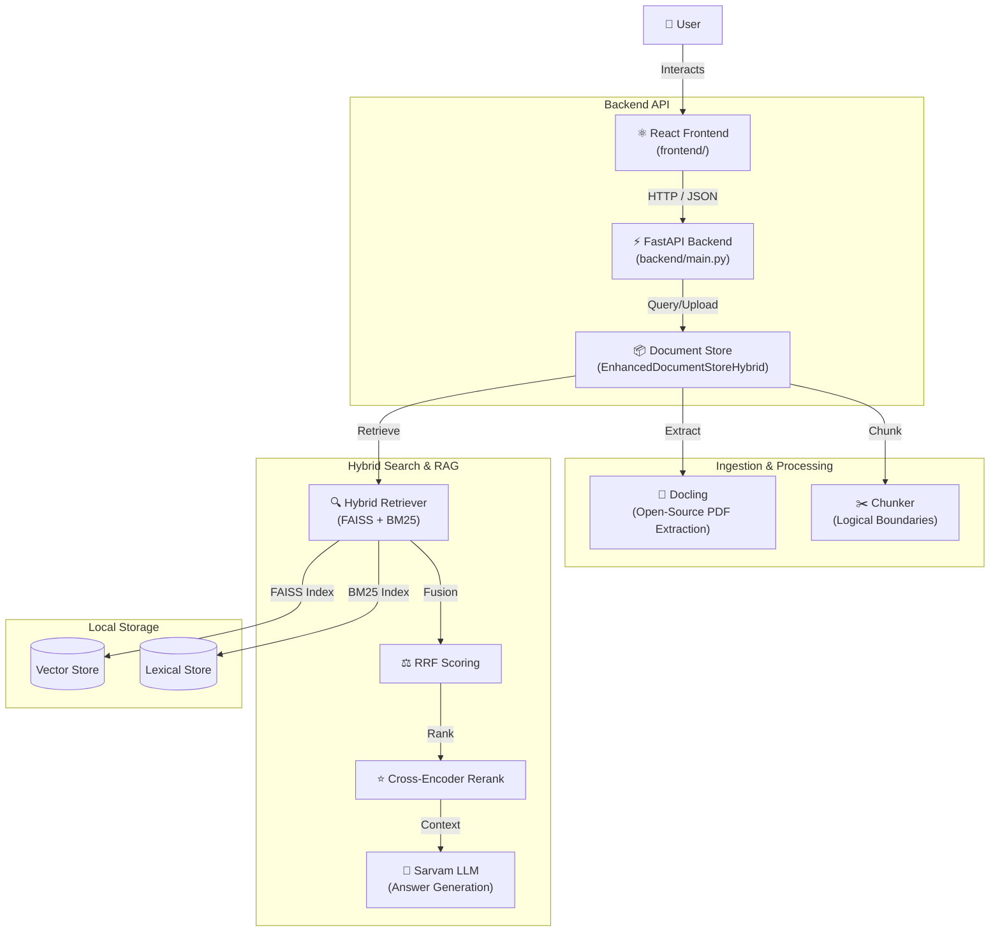

# 📄 Advanced Document Retrieval System

An intelligent, high-performance RAG (Retrieval-Augmented Generation) system for PDF documents. Built with a modern **React** frontend and a robust **FastAPI** backend, featuring open-source document extraction, hybrid search, and cross-encoder reranking.

---

## 🚀 Key Features

*   **Modern React UI**: A responsive, premium dashboard for document management and intelligent chat.
*   **Open-Source Extraction**: Leverages **Docling** for high-fidelity, structure-aware PDF parsing.
*   **Hybrid Search Engine**: Combines **FAISS** (Vector Search) and **BM25** (Lexical Search) with **Reciprocal Rank Fusion (RRF)** for superior retrieval precision.
*   **Advanced Reasoning**: Powering answers with **Sarvam-105B** (via Sarvam API or Modal vLLM) for superior reasoning and document understanding.
*   **Semantic Routing**: Automatic query routing to specific document sections based on content type.
*   **Detailed Analytics**: Real-time stats on processing time, chunk counts, and retrieval confidence.

---

## 🏗️ Architecture



---

## 🛠️ Setup & Execution

### 1. Requirements
* **Node.js**: For the React frontend.
* **Python 3.10+**: For the FastAPI backend.
* **Sarvam API Key**: For answer generation (Sarvam-105B).

### 2. Backend Setup
1.  Navigate to the backend directory:
    ```bash
    cd backend
    ```
2.  Install dependencies:
    ```bash
    pip install -r requirements.txt
    ```

### 3. Model & Worker Setup (Sarvam + Modal)

The system is optimized for cloud scale using **Modal** for heavy processing and **Sarvam AI** for high-performance reasoning.

#### A. Sarvam AI (API Setup)
1.  Sign up at [sarvam.ai](https://www.sarvam.ai/).
2.  Generate an API Key and add it to your `.env`:

    ```text
    SARVAM_API_KEY=your_sarvam_api_key
    ```

#### B. Modal Deployment (LLM, Docling, Reranker)
1.  **Initialize Modal**: `pip install modal && modal setup`.
2.  **Create Secrets**: In the Modal dashboard, create a secret named `huggingface-secret` containing your `HF_TOKEN`.
3.  **Deploy the Stack**:
    ```bash
    # 1. LLM Server (Gemma-2 9B)
    modal run modal/modal_llm_server.py::download_model
    modal deploy modal/modal_llm_server.py

    # 2. Docling Worker (PDF Extraction)
    modal deploy modal/modal_docling_worker.py

    # 3. Reranker Server (MiniLM-L-6)
    modal run modal/modal_reranker_server.py::download_model
    modal deploy modal/modal_reranker_server.py
    ```
4.  **Finalize .env**: Copy the deployment URLs into your backend `.env`:
    ```text
    LLM_URL=https://your-llm-server.modal.run
    DOCLING_URL=https://your-docling-worker.modal.run
    RERANKER_URL=https://your-reranker-server.modal.run
    ```

> [!IMPORTANT]
> **Deployment Workflow**:
> *   **First Time**: Run `download_model` **then** `deploy`. This ensures the Volume is populated before the server starts.
> *   **Subsequent Changes**: Only run `modal deploy`. You do NOT need to redownload unless you change the `MODEL_NAME` in the script.
> *   **Why Deploy?**: `modal run` gives a temporary development URL. `modal deploy` creates the permanent production URL required for your `.env`.

### 4. Running the Frontend
1.  Navigate to the frontend directory:
    ```bash
    cd frontend
    ```
2.  Install dependencies:
    ```bash
    npm install
    ```
3.  Run Dev Server:
    ```bash
    npm run dev
    ```
4.  Open `http://localhost:5173` in your browser.

---

## 📈 Performance & Evaluation

The system's performance is validated using the **Ragas** evaluation framework, focusing on faithfulness, relevancy, and retrieval quality.

### Evaluation Metrics (Latest Run)
*   **Faithfulness**: **0.84** (High adherence to the source document)
*   **Answer Relevancy**: **0.86** (Measures how pertinent the answer is to the query)
*   **Context Precision**: **0.88** (Quality of the retrieved chunks)
*   **Context Recall**: **0.976** (Ability to retrieve all relevant information)

> [!NOTE]
> Evaluation was performed on a diverse set of complex financial and legal documents to ensure robustness across different domains.

---

## 📂 Project Structure

```text
document-retrieval-system/
├── backend/                 # FastAPI Backend & RAG Logic
│   ├── core/                # Core Processing Engine
│   │   ├── document_store.py  # Hybrid storage & management
│   │   ├── retriever.py       # FAISS + BM25 + RRF logic
│   │   ├── pdf_processor.py   # Docling integration
│   │   ├── chunker.py         # Advanced text chunking
│   │   └── query_router.py    # Semantic query routing
│   ├── llm/                 # LLM & Embedding Configuration
│   │   ├── llm_router.py      # Modal/Sarvam smart routing
│   │   └── gemini_setup.py    # Legacy/Fallback config
│   ├── modal/               # Cloud Deployment Scripts
│   │   ├── modal_llm_server.py # vLLM hosting (Gemma-2)
│   │   ├── modal_docling_worker.py # Serverless PDF extraction
│   │   └── modal_reranker_server.py # Cross-Encoder hosting
│   ├── main.py              # API Entry Point
│   ├── requirements.txt     # Python dependencies
│   └── .env                 # API Keys & Worker URLs
├── frontend/                # Vite + React Frontend
│   ├── src/                 # Application Source
│   │   ├── App.jsx          # Main Chat Interface & Logic
│   │   ├── App.css          # Premium Glassmorphism styling
│   │   └── main.jsx         # React entry point
│   ├── public/              # Static assets
│   ├── package.json         # Frontend dependencies
│   └── vite.config.js       # Vite proxy & build config
├── notebooks/               # R&D and Evaluation
│   └── evaluation.ipynb     # Ragas benchmarking pipeline
├── results/                 # Metrics & Analysis outputs
├── .gitignore               # Build & Secret exclusions
└── README.md                # Project documentation
```